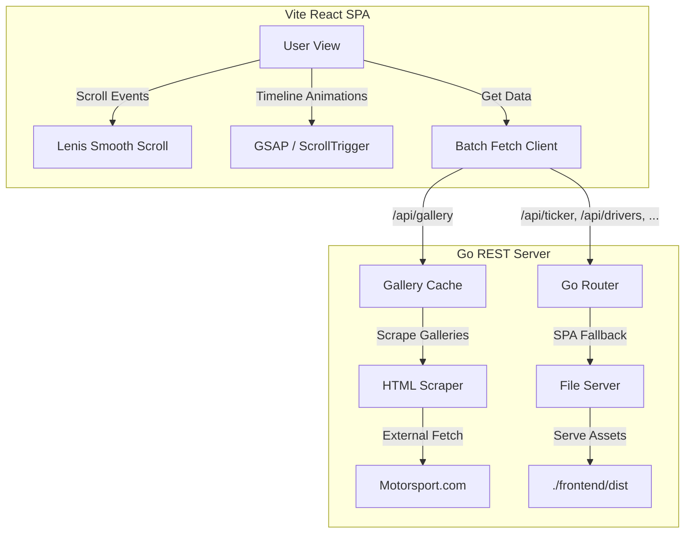

# F1 Apex — Formula 1 Racing Dashboard



<div align="center">

[](https://golang.org)
[](https://vitejs.dev)
[](https://react.dev)
[](https://gsap.com)
[](LICENSE)

**A cinematic, high-performance web dashboard displaying Formula 1 racing insights, standings, circuits, and media.** Built using Go, React, Vite, and hardware-accelerated animations via GSAP and Lenis.

[Explore Features](#-key-features) · [Quick Start](#-quick-start) · [Architecture](#%EF%B8%8F-system-architecture)

</div>

---

## 🏎️ Key Features

### 🎬 Cinematic Hero Video & Interactive Intro
* **High-Octane Autoplay**: Serves a full-screen looping video of F1 action directly upon entry.
* **Smart Blur Transition**: Automatically transitions after 5 seconds to a dimmed (`opacity: 0.15`), subtly blurred (`4px`) background viewport with a hardware-accelerated overlay.
* **Scroll-to-Experience Prompt**: Features a pulsing, bounce-animated scroll prompt. Scrolling immediately sweeps the video into the background, revealing the header animations over it.
* **Carbon Fiber Telemetry Grid**: Overlays a micro 3px grid structure to mask scaling artifacts on high-resolution displays.

### 📊 Dynamic Standings Card Fan-out
* **GSAP Stack Reveal**: Driver standings cards fan out from a central stacked deck using scroll-triggered 3D animations.
* **Racer Portraits Integration**: Blends semi-transparent portraits of drivers directly into the card headers. Hovering over a card dynamically zooms the portrait (`scale(1.05)`) and increases opacity (`0.75`).
* **High-Contrast Numbers**: Leverages high-visibility white race numbers layered over portraits using custom z-indexing to keep standings readable.

### 📸 Live-Scraped Photo Gallery (Motorsport.com)
* **Real-time Scraper Endpoint**: The Go server fetches and parses `https://www.motorsport.com/f1/galleries/` using the standard library.
* **Automated Upscaler**: Automatically updates image CDN paths to upscale thumbnails to high-resolution `s800` quality.
* **Performance Caching**: Implements a thread-safe `sync.Mutex` in-memory cache expiring every 5 minutes to prevent external rate-limiting and minimize page latency.
* **Resilient Failbacks**: Uses a fallback static media list if the external gallery is offline.

### 🧭 Monaco Circuit Spotlight
* **Monaco SVG Path Drawing**: Draws the Monaco track outline in real-time as the user scrolls.
* **Interactive Checkpoint Flags**: Reveals corner label tags (Mirabeau, Fairmont, Rascasse) dynamically as the SVG track is drawn.

---

## 🏗️ System Architecture

The application is structured as a Go monolithic server that handles REST API endpoints, background scraping, and serves the static production-built SPA React frontend.



---

## ⚡ Quick Start

### Prerequisites
* **Go** (1.22+ recommended)
* **Node.js** (v18+) & **npm**

### 1. Build and Run via Makefile / Commands
Clone the repository and install frontend dependencies:

```bash
# Clone the repository
git clone https://github.com/your-username/f1-web.git
cd f1-web

# Install frontend dependencies
cd frontend
npm install
```

### 2. Build Frontend Assets
Compile the React frontend into production-ready static assets:

```bash
npm run build
cd ..
```

### 3. Start Go Server
Run the Go application. The Go server will start on port `8080` and host both the API and the React client:

```bash
go run main.go
```

Open [http://localhost:8080](http://localhost:8080) in your browser.

---

## 🛠️ Technology Stack

* **Backend**: Go (standard HTTP library)
* **Frontend**: React (v19), Vite (v8), Vanilla CSS
* **Animations**: GSAP (GreenSock), GSAP ScrollTrigger
* **Smooth Scrolling**: Lenis Scroll
* **Linter**: Oxlint (Rust-based super fast linter)

---

<div align="center">
  <p>F1 Apex is a fan-made project and is not affiliated with the Formula One Group.</p>
</div>
